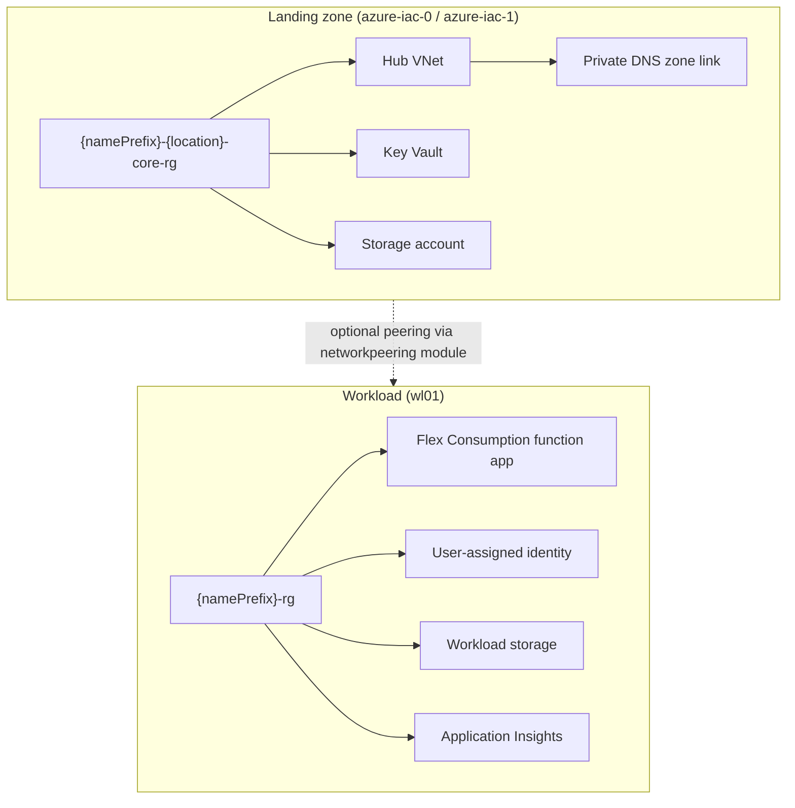

# Azure IaC

Infrastructure-as-code for an Azure landing zone and sample workloads, built with [Bicep](https://learn.microsoft.com/azure/azure-resource-manager/bicep/overview). Templates compose [Azure Verified Modules (AVM)](https://github.com/Azure/bicep-registry-modules) where possible and share reusable modules from [`modules/`](modules/).

Each template documents its contract with `metadata description` and `@description` decorators so parameter help appears in the IDE, deployment UI, and generated ARM JSON.

## Architecture



### Deployment stacks

| Stack | Scope | Purpose |
|-------|-------|---------|
| [`azure-iac-0/`](azure-iac-0/) | Subscription | Primary landing zone: core resource group, hub VNet, **new** private DNS zone, Key Vault, and storage. |
| [`azure-iac-1/`](azure-iac-1/) | Subscription | Secondary region landing zone: same core resources, but links to an **existing** private DNS zone in another resource group. |
| [`wl01/`](wl01/) | Subscription | Sample workload: Python Flex Consumption function app with identity-based deployment storage, App Insights, and RBAC on storage. |

Default parameter values for each stack live in the matching `main.bicepparam` file.

#### `azure-iac-0` vs `azure-iac-1`

Both stacks deploy a hub network, Key Vault, and core storage into `{namePrefix}-{location}-core-rg`. The main difference is DNS:

- **azure-iac-0** creates a private DNS zone (`{namePrefix}-company.com`) and registers the hub VNet with it.
- **azure-iac-1** references an existing zone (for example, one created by `azure-iac-0` in another region) via the `dnsResourceGroup` parameter and only creates the VNet link.

Use `azure-iac-0` for the first region. Use `azure-iac-1` when adding a hub in a second region that should share the same private DNS zone.

### Hub network layout

[`modules/virtualnetwork.bicep`](modules/virtualnetwork.bicep) deploys hub or spoke VNets. Hub subnets are carved from the VNet CIDR with `cidrSubnet()`:

| Subnet | Default prefix length |
|--------|------------------------|
| `GatewaySubnet` | /26 |
| `AzureFirewallSubnet` | /26 |
| `AzureFirewallManagementSubnet` | /26 |
| `AzureBastionSubnet` | /26 |

Set `networkType` to `hub` or `spoke`. Additional subnets can be merged in via the `subnets` parameter. The module exposes `subnetIDs`, `subnetNames`, `NetworkResourceID`, and `NetworkName` for downstream stacks (for example, private endpoints).

## Repository structure

```
.
├── modules/                              # Shared Bicep modules
│   ├── virtualnetwork.bicep              # Hub/spoke VNet and subnets (AVM)
│   ├── networkpeering.bicep              # Bidirectional VNet peering (AVM)
│   ├── keyvault.bicep                    # Key Vault with RBAC (AVM)
│   ├── storage.bicep                     # StorageV2 account and optional containers (AVM)
│   ├── privateendpoints.bicep            # Blob private endpoint (AVM)
│   ├── appserviceplan.bicep              # Linux Flex Consumption plan, SKU FC1 (AVM)
│   ├── appinsight.bicep                  # Log Analytics workspace + App Insights (AVM)
│   └── functionapp.bicep                 # Python Flex Consumption function app (AVM)
├── azure-iac-0/                          # Primary landing-zone deployment
│   ├── main.bicep
│   └── main.bicepparam
├── azure-iac-1/                          # Secondary-region landing zone (shared DNS)
│   ├── main.bicep
│   └── main.bicepparam
├── wl01/                                 # Sample function-app workload
│   ├── main.bicep
│   └── main.bicepparam
└── .github/workflows/
    ├── iac-0-*.yml                       # PR tests and main-branch deploy for azure-iac-0
    ├── iac-1-*.yml                       # PR tests and deploy for azure-iac-1
    └── wl01-*.yml                        # PR tests and deploy for wl01
```

New workload stacks can reference shared modules with a relative path (for example, `../modules/storage.bicep`).

## Shared modules

| Module | Deploys |
|--------|---------|
| `virtualnetwork.bicep` | VNet with type-specific default subnets; supports custom subnet overrides. |
| `networkpeering.bicep` | Two-way peering between existing VNets in different resource groups. |
| `keyvault.bicep` | RBAC-enabled Key Vault with template-deployment access. |
| `storage.bicep` | StorageV2 account, optional blob containers, and RBAC assignments. |
| `privateendpoints.bicep` | Private endpoint for blob storage on an existing subnet. |
| `appserviceplan.bicep` | Reserved Linux App Service plan (FC1) for Flex Consumption. |
| `appinsight.bicep` | Log Analytics workspace linked to an Application Insights component. |
| `functionapp.bicep` | Python 3.13 Flex Consumption function app with user-assigned identity and blob deployment storage. |

Parameter details are defined in each module file. Open a `.bicep` file and hover a parameter name for inline documentation, or compile to JSON:

```bash
az bicep build --file modules/virtualnetwork.bicep
# Inspect parameters[].metadata.description in the generated JSON
```

## Prerequisites

- [Azure CLI](https://learn.microsoft.com/cli/azure/install-azure-cli) with Bicep (`az bicep install` if needed)
- Azure subscription with rights to deploy at subscription scope and create resource groups
- For CI/CD: GitHub OIDC federation for [`azure/login@v2`](https://github.com/Azure/login)

## Local development

Log in and select a subscription:

```bash
az login
az account set --subscription "<subscription-id>"
```

Compile a template:

```bash
az bicep build --file azure-iac-0/main.bicep
```

Deploy with a parameter file:

```bash
az deployment sub create \
  --location eastus2 \
  --template-file azure-iac-0/main.bicep \
  --parameters azure-iac-0/main.bicepparam
```

Override a single parameter:

```bash
az deployment sub create \
  --location eastus2 \
  --template-file azure-iac-0/main.bicep \
  --parameters azure-iac-0/main.bicepparam namePrefix=dev
```

Preview changes:

```bash
az deployment sub what-if \
  --location eastus2 \
  --template-file azure-iac-0/main.bicep \
  --parameters azure-iac-0/main.bicepparam
```

Use the same pattern for `azure-iac-1/` and `wl01/`, matching the `--location` value to the region in each stack's parameter file.

## CI/CD

Each deployment stack has three GitHub Actions workflows:

| Workflow suffix | Trigger | Actions |
|-----------------|---------|---------|
| `*-unit-test.yml` | Pull request to `main` (path-filtered) | Lint, validate, what-if, [Checkov](https://www.checkov.io/) security scan |
| `*-lint-validate-deploy.yml` | Push to `main` (path-filtered) | Lint, validate, deploy to the `production` environment |
| `*-manual-deploy.yml` | `workflow_dispatch` | Lint, validate, deploy on demand |

`azure-iac-0` auto-deploys when files under `azure-iac-0/**` change on `main`. The same path-filter pattern applies to `azure-iac-1` and `wl01`.

### Required GitHub configuration

| Name | Type | Used for |
|------|------|----------|
| `AZURE_CLIENT_ID` | Secret | OIDC application client ID |
| `AZURE_TENANT_ID` | Secret | Microsoft Entra tenant ID |
| `AZURE_SUBSCRIPTION_ID` | Secret | Target subscription |
| `AZURE_RESOURCE_GROUP_NAME` | Secret / variable | Resource group context for validate and deploy steps |

Configure [federated credentials](https://learn.microsoft.com/entra/workload-id/workload-identity-federation-create-trust) on the app registration for passwordless GitHub Actions login.

## License

Add a license file if you plan to share or open-source this repository.
