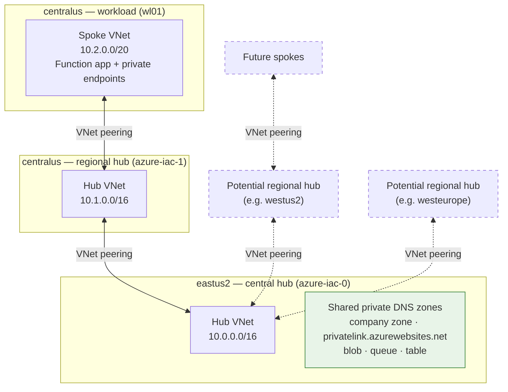
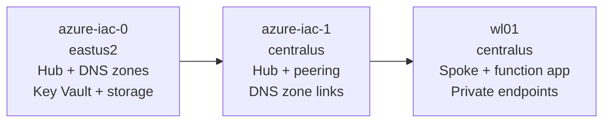

# Azure IaC

Infrastructure-as-code for a multi-region Azure landing zone and a sample private workload, built with [Bicep](https://learn.microsoft.com/azure/azure-resource-manager/bicep/overview). Deployment templates consume modules from a private Bicep registry (`br/JSRegistry:...`) and [Azure Verified Modules (AVM)](https://github.com/Azure/bicep-registry-modules) where a public module is used directly.

Each template documents its contract with `metadata description` and `@description` decorators. Parameter files (`.bicepparam`) use matching `//` comments where Bicep decorators are not supported.

## Architecture

The repository models a hub-and-spoke design across two regions. The first landing-zone stack creates shared private DNS zones; the second region links to those zones and peers its hub. Workloads deploy into spoke networks that peer with a regional hub and consume the shared DNS infrastructure.

### Network topology

The central hub in `eastus2` hosts the shared private DNS zones for the entire estate. Regional hubs peer to the central hub, and workload spokes peer to their regional hub. Additional regional hubs follow the same pattern as `azure-iac-1`: peer to the central hub and link to the existing DNS zones rather than creating new ones.



Solid lines are peering links deployed by this repository; dashed elements show how future regional hubs and spokes would attach. DNS zone links (not shown) point every VNet back at the shared zones in the central hub's resource group.

**Deployment order** — each stack depends on the one before it:




### Deployment stacks

| Stack | Scope | Region (default) | Resource group | Purpose |
|-------|-------|------------------|----------------|---------|
| [`azure-iac-0/`](azure-iac-0/) | Subscription | `eastus2` | `{namePrefix}-{location}-core-rg` | Primary landing zone: hub VNet, **new** private DNS zones, Key Vault, and core storage. |
| [`azure-iac-1/`](azure-iac-1/) | Subscription | `centralus` | `{namePrefix}-{location}-core-rg` | Secondary-region hub: VNet peering to `azure-iac-0`, links to **existing** DNS zones in the primary region. |
| [`wl01/`](wl01/) | Subscription | `centralus` | `{namePrefix}-{location}-rg` | Sample workload: Python Flex Consumption function app with private networking, private endpoints, and identity-based storage access. |

Default parameter values for each stack live in the matching `main.bicepparam` file.

### Recommended deployment order

1. **azure-iac-0** — Creates the primary hub (`10.0.0.0/16`), company private DNS zone, `privatelink.AzureWebSites.net`, and storage private link zones (`blob`, `queue`, `table`).
2. **azure-iac-1** — Deploys the secondary hub (`10.1.0.0/16`), peers it to the eastus2 hub, and links the new VNet to DNS zones in `js-eastus2-core-rg`.
3. **wl01** — Deploys a spoke (`10.2.0.0/20`), peers to the regional hub, links to shared DNS zones, and provisions the function app stack with private endpoints.

Update `main.bicepparam` in each stack to match your subscription naming before deploying.

## Stack details

### azure-iac-0 — primary landing zone

[`main.bicep`](azure-iac-0/main.bicep) creates `{namePrefix}-{location}-core-rg` and delegates networking to [`network/network.bicep`](azure-iac-0/network/network.bicep).

| Component | Description |
|-----------|-------------|
| Hub VNet | Firewall, Gateway, Bastion, and optional workload subnets via `br/JSRegistry:network/virtual-network:v1.0.0`. |
| Private DNS | Company domain zone, `privatelink.AzureWebSites.net`, and per-service storage zones with VNet links. |
| Key Vault | RBAC-enabled vault with template-deployment access. |
| Storage | Core `StorageV2` account for diagnostics and shared artifacts. |

Default address space: `10.0.0.0/16` in `eastus2`.

### azure-iac-1 — secondary-region hub

Same core resources as `azure-iac-0`, but networking differs:

| Component | Description |
|-----------|-------------|
| Hub VNet | New hub in the second region (`10.1.0.0/16` by default). |
| VNet peering | Bidirectional peering to the `azure-iac-0` hub via `br/JSRegistry:network/peering:v1.0.0`. |
| Private DNS | References **existing** zones in `hubResourceGroupName` (default `js-eastus2-core-rg`) and creates VNet links only. |

Deploy this stack after `azure-iac-0` so the shared DNS zones already exist.

### wl01 — function app workload

[`main.bicep`](wl01/main.bicep) orchestrates domain-specific modules under the workload resource group:

```
wl01/
├── main.bicep              # Subscription entry point
├── main.bicepparam         # Environment parameters
├── network/network.bicep   # Spoke VNet, subnets, peering, DNS links
├── identity/identity.bicep # User-assigned managed identity
├── storage/storage.bicep   # Storage account, RBAC, storage private endpoints
├── insights/app-insights.bicep
└── compute/function-app.bicep  # App Service plan, function app, inbound PE
```

| Component | Description |
|-----------|-------------|
| Spoke VNet | `10.2.0.0/20` with `PrivateEndpointSubnet` (`10.2.1.0/24`) and `FunctionAppSubnet` (`10.2.2.0/24`, delegated to `Microsoft.App/environments`). |
| Hub peering | Peers the spoke to the regional hub (`hubNetworkName` / `hubResourceGroupName`). |
| DNS | Links the spoke to existing company, storage, and function-app private link zones in `dnsResourceGroupName`. |
| Identity | User-assigned managed identity granted storage data roles on the workload account. |
| Storage | Private `StorageV2` account with blob container; private endpoints for `blob`, `queue`, and `table`. |
| Compute | Python 3.13 Flex Consumption function app (SKU FC1) with VNet integration, disabled public access, identity-based deployment storage, and an inbound private endpoint. |
| Monitoring | Log Analytics workspace and Application Insights component. |

## Network layout

### Hub subnets

The `br/JSRegistry:network/virtual-network` module carves hub subnets from the VNet CIDR with `cidrSubnet()`:

| Subnet | Default prefix length |
|--------|------------------------|
| `GatewaySubnet` | /26 |
| `AzureFirewallSubnet` | /26 |
| `AzureFirewallManagementSubnet` | /26 |
| `AzureBastionSubnet` | /26 |

Set `networkType` to `hub` or `spoke`. Additional subnets merge in via the `subnets` parameter. The module outputs `subnetIDs`, `subnetNames`, `NetworkResourceID`, and `NetworkName`.

### Address spaces (defaults)

| Stack | CIDR | Region |
|-------|------|--------|
| azure-iac-0 | `10.0.0.0/16` | eastus2 |
| azure-iac-1 | `10.1.0.0/16` | centralus |
| wl01 spoke | `10.2.0.0/20` | centralus |

## Repository structure

```
.
├── azure-iac-0/                          # Primary landing-zone deployment
│   ├── main.bicep
│   ├── main.bicepparam
│   └── network/network.bicep
├── azure-iac-1/                          # Secondary-region landing zone
│   ├── main.bicep
│   ├── main.bicepparam
│   └── network/network.bicep
├── wl01/                                 # Sample function-app workload
│   ├── main.bicep
│   ├── main.bicepparam
│   ├── network/network.bicep
│   ├── identity/identity.bicep
│   ├── storage/storage.bicep
│   ├── insights/app-insights.bicep
│   └── compute/function-app.bicep
├── .github/workflows/
│   ├── iac-0-*.yml                       # PR tests and main-branch deploy for azure-iac-0
│   ├── iac-1-*.yml                       # PR tests and deploy for azure-iac-1
│   └── wl01-*.yml                        # PR tests and deploy for wl01
└── z-legacy-modules/                     # Archived local module sources (not used by deployments)
    ├── virtualnetwork.bicep
    ├── networkpeering.bicep
    ├── keyvault.bicep
    ├── storage.bicep
    ├── privateendpoints.bicep
    ├── appserviceplan.bicep
    ├── appinsight.bicep
    └── functionapp.bicep
```

New workload stacks should follow the `wl01` pattern of domain folders under the stack root and consume shared building blocks from `br/JSRegistry:...`.

## Bicep registry modules

Active deployments reference the private `JSRegistry` Bicep registry and, in a few cases, AVM public modules directly (for example, private DNS zone links and subnet resources).

| Registry module | Used for |
|-----------------|----------|
| `network/virtual-network:v1.0.0` | Hub and spoke VNets with type-specific default subnets. |
| `network/peering:v1.0.0` | Bidirectional VNet peering across resource groups. |
| `network/private-endpoint:v1.0.0` | Private endpoints with DNS zone groups. |
| `key-vault:v1.0.0` | RBAC-enabled Key Vault. |
| `storage/storage-account:v1.5.1` | StorageV2 accounts, containers, and RBAC. |
| `web/app-service-plan:v1.0.0` | Linux Flex Consumption plan (FC1). |
| `web/function-app:v1.0.0` | Python Flex Consumption function app with identity-based deployment storage. |
| `ops/app-insight:v1.0.0` | Log Analytics workspace and Application Insights. |

### Legacy local modules

[`z-legacy-modules/`](z-legacy-modules/) contains the original local Bicep wrappers that preceded the private registry. Nothing in the deployment stacks references this folder anymore; it is kept for reference and sorts last in the repository tree. Published registry modules supersede these files.

Parameter details are defined in each template file. Open a `.bicep` file and hover a parameter name for inline documentation, or compile to JSON:

```bash
az bicep build --file azure-iac-0/main.bicep
# Inspect parameters[].metadata.description in the generated JSON
```

## Prerequisites

- [Azure CLI](https://learn.microsoft.com/cli/azure/install-azure-cli) with Bicep (`az bicep install` if needed)
- Azure subscription with rights to deploy at subscription scope and create resource groups
- For CI/CD: GitHub OIDC federation for [`azure/login@v2`](https://github.com/Azure/login)

## Local development

Log in and select a subscription:

```bash
az login
az account set --subscription "<subscription-id>"
```

Compile a template:

```bash
az bicep build --file azure-iac-0/main.bicep
```

Deploy with a parameter file:

```bash
az deployment sub create \
  --location eastus2 \
  --template-file azure-iac-0/main.bicep \
  --parameters azure-iac-0/main.bicepparam
```

Override a single parameter:

```bash
az deployment sub create \
  --location eastus2 \
  --template-file azure-iac-0/main.bicep \
  --parameters azure-iac-0/main.bicepparam namePrefix=dev
```

Preview changes:

```bash
az deployment sub what-if \
  --location eastus2 \
  --template-file azure-iac-0/main.bicep \
  --parameters azure-iac-0/main.bicepparam
```

Use the same pattern for the other stacks, matching `--location` to the deployment region for that stack:

| Stack | `--location` |
|-------|--------------|
| azure-iac-0 | `eastus2` |
| azure-iac-1 | `centralus` |
| wl01 | `centralus` |

> **Note:** Subscription deployment `--location` is the metadata region for the deployment itself. Resource regions are set by each template's `location` parameter and resource group scope.

## CI/CD

Each deployment stack has three GitHub Actions workflows:

| Workflow suffix | Trigger | Actions |
|-----------------|---------|---------|
| `*-unit-test.yml` | Pull request to `main` (path-filtered) | Lint, validate, what-if, [Checkov](https://www.checkov.io/) security scan |
| `*-lint-validate-deploy.yml` | Push to `main` (path-filtered) | Lint, validate, deploy to the `production` environment |
| `*-manual-deploy.yml` | `workflow_dispatch` | Lint, validate, deploy on demand |

Main-branch deploys use **deployment stacks** (`type: deploymentStack`) with `action-on-unmanage-resources: delete`, so resources removed from a template are deleted from Azure on the next deploy.

Path filters isolate changes: `azure-iac-0/**`, `azure-iac-1/**`, and `wl01/**` each trigger only their own workflows.

### Required GitHub configuration

| Name | Type | Used for |
|------|------|----------|
| `AZURE_CLIENT_ID` | Secret | OIDC application client ID |
| `AZURE_TENANT_ID` | Secret | Microsoft Entra tenant ID |
| `AZURE_SUBSCRIPTION_ID` | Secret | Target subscription |
| `AZURE_RESOURCE_GROUP_NAME` | Secret or variable | Resource group context for validate and deploy steps |

Configure [federated credentials](https://learn.microsoft.com/entra/workload-id/workload-identity-federation-create-trust) on the app registration for passwordless GitHub Actions login.

## License

Add a license file if you plan to share or open-source this repository.
